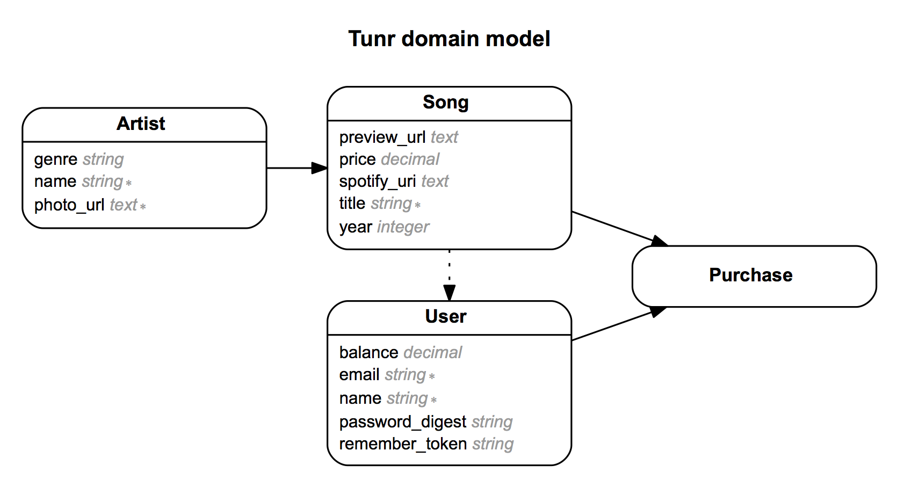

# Tunr

### GA WDI DC April 2014, Project 1

### Overview

**Tunr** is an iTunes-like application for purchasing and listening to music. Tunr was developed as a sample Rails project for the April 2014 Web Development Immersive course at General Assembly. It was developed over a 4 day sprint to model the agile software development process.

### Technologies Used

* Ruby 2.1.1
* Ruby on Rails 4.1.1
* PostgreSQL Database
* Authentication & Authorization from scratch using [bcrypt-ruby](http://bcrypt-ruby.rubyforge.org/)
* [iTunes search API](https://www.apple.com/itunes/affiliates/resources/documentation/itunes-store-web-service-search-api.html) & [HTTParty](https://github.com/jnunemaker/httparty)
* Testing using using [rspec-rails](https://github.com/rspec/rspec-rails), [capybara](https://github.com/jnicklas/capybara), [shoulda-matchers](https://github.com/thoughtbot/shoulda-matchers) and [factory_girl_rails](https://github.com/thoughtbot/factory_girl_rails)

### User Stories Completed

* As a user I should land on a splash page for the site so that I have some idea of how to get started
* As an admin, I want to be able to curate the list of artists and songs available for purchase on Tunr so that I can appeal to the largest audience
* As a user I should be able to sign in and out of a secure account so that I can keep my payment information, songs, data, etc. safe and private
* As a user I should be able to preview a song so that I can determine whether I like it before I decide to purchase it
* As a user I should be able to purchase a song so that I can manage music that I like

### Backlog

A full list of user stories can be found by looking at [this Pivotal Tracker Project](https://www.pivotaltracker.com/s/projects/1083298)

### ERD

---
###### Written by Peter Lai, Greg MacWilliam & Travis Vander Hoop